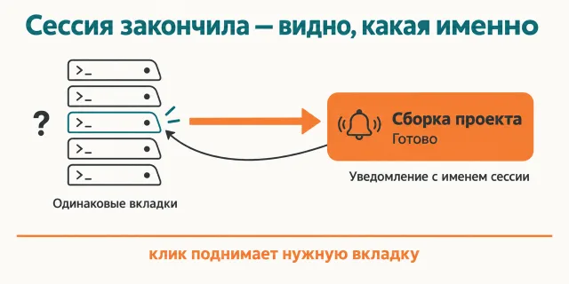
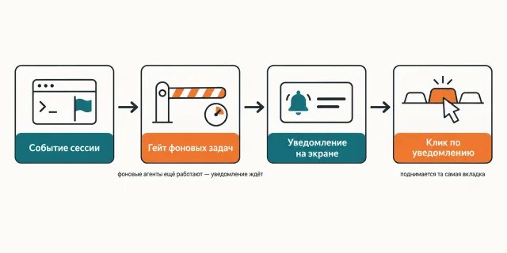

English · [Русский](README.md)

# Claude Code finished a minute ago and you are still staring at the other window

A macOS notification arrives when the session has finished a task, asked a question, or produced
a plan. The subtitle is the session name, so across ten tabs you can tell which one freed up.

```
claude plugin marketplace add https://github.com/beCyborg/jadlis-hub
claude plugin install jadlis-notifications@jadlis
```

Installing it separately is usually unnecessary: it arrives as a dependency of `jadlis-claudecode`.
No keys and no subscriptions; the patched `darwin/arm64` binary is committed to the repository.



In words: on the left a dozen identical tabs, on the right a notification with the session name,
and a click on it raises that very tab.

This is a fork of [claude-notifications-go](https://github.com/777genius/claude-notifications-go)
under GPL-3.0, published as my working setup rather than as a product.

## Before → after

| Without notifications | Upstream plugin | This fork |
|---|---|---|
| **How you learn the task is done.** You switch to the terminal and look. | A "✅ Completed" notification arrives. | The same notification, but the titles are Russian: «✅ Задача выполнена», «🔍 Ревью завершено», «❓ Есть вопрос», «📋 План готов». |
| **Which session freed up.** No way to tell — you go hunting through tabs. | The subtitle is `branch · folder`: three sessions in one repository share it. | The subtitle is the real session name from `custom-title.json` — the same one you see inside Claude Code. |
| **What the body says.** — | A counter suffix is appended to the text: `📝 1 new ▶ 2 cmds ⏱ 41s`. | Only the summary text; the suffix is gone. |
| **What happens with background agents.** — | "Task complete" fires on every intermediate Stop while a workflow is still running. | A gate counts unfinished background agents and workflows and holds the notification while that count is above zero. |
| **How it sounds.** — | Sound is on, and the title also carries a session label. | Sound is off, the label is off, and a click raises the right iTerm2 tab. |

## How it works



Going in — an event from a Claude Code session.
Inside — a gate counts unfinished background agents and workflows and holds the notification
while that count is above zero.
Coming out — a macOS notification whose click raises that session's tab.

In words: session event → background-task gate → notification on screen → a click raises that
very tab.

The input is five Claude Code hooks: `Stop`, `SubagentStop`, `PreToolUse` (on `ExitPlanMode` and
`AskUserQuestion`), `Notification` (on a permission prompt) and `TeammateIdle`.
Inside, `bin/hook-wrapper.sh` runs a Go binary that parses the event and sends the notification.
The output is a native macOS notification titled by status, subtitled with the session name.

The `Stop` hook does not go straight there — it goes through `bin/stop-gate.sh`. The gate reads the
session transcript (`bin/pending-bg-tasks.py`) and counts background agents and workflows that were
launched but never finished. Above zero, the notification is suppressed; at zero, the event is
forwarded to `hook-wrapper.sh` unchanged. Any counter error counts as zero, so the notification
still gets through. A launch older than six hours with no completion notice is treated as dead,
otherwise the gate would stay silent forever.
The decision log is `${TMPDIR}/jadlis-notifications-stop-gate.log`, truncated at 256 KB.

The binary reads its config from `~/.claude/claude-notifications-go/config.json`, and failing that
from the plugin's `config/config.json`. That path is hardcoded in the upstream Go code and was
deliberately left alone in the fork, so an existing config is picked up as is. Everything else that
was named after the plugin moved into its own namespace (`~/.cache/jadlis-notifications/`,
`~/.claude/jadlis-notifications/`), so an upstream install side by side gets in nobody's way.

If the binary goes missing or drifts from the version in `plugin.json`, `hook-wrapper.sh` downloads
it from this repository's `v<version>` release and checks the sha256 — it never reaches upstream.

## Installing and the first run

**a) Text to paste to an agent.** Copy the whole thing into a Claude Code chat:

```
You are an installer. Install the jadlis-notifications plugin from the jadlis marketplace
on this Mac. This plugin needs no keys, so do not ask me for anything secret.
Run exactly these commands, verbatim, without shortening anything:
1. claude plugin marketplace add https://github.com/beCyborg/jadlis-hub
2. claude plugin install jadlis-notifications@jadlis
3. claude plugin list — show me the jadlis-notifications line and its version.
Then tell me in one line: restart Claude Code so the hooks are picked up.
Before each command show it to me in full and wait for "yes". If I say "no", do not run it,
tell me what you skipped, and move on.
If a command errors out, stop, show the output, and do not move to the next one.
```

**b) Commands by hand.**

```
claude plugin marketplace add https://github.com/beCyborg/jadlis-hub
claude plugin install jadlis-notifications@jadlis
claude plugin list
```

The first command installs nothing — it adds the marketplace. Only the second installs, and it
comes off in one line: `claude plugin uninstall jadlis-notifications@jadlis --keep-data`.

**c) First run.** Restart Claude Code and let a session finish any task — the notification arrives
on its own, the plugin has no command to run. macOS asks for notification permission the first
time: allow it, or everything goes nowhere.

**d) Click-to-focus in iTerm2.** Hitting the exact tab needs the iTerm2 Python API, and that is
one-time by hand: iTerm2 → Settings → General → Magic → **Enable Python API**, then restart iTerm2.
`bin/install.sh` creates the venv during installation; by hand it is
`python3 -m venv ~/.claude/claude-notifications-go/iterm2-venv` plus
`~/.claude/claude-notifications-go/iterm2-venv/bin/pip install iterm2`. Without the Python API
a click just raises iTerm2 without picking a tab.

## Limits, cost, updating

**What it does not do.** It does not work anywhere but macOS on Apple Silicon: the release carries
`darwin/arm64` only, the other upstream platforms are not built. It sends nothing to Telegram or
Slack — webhooks are off in the shipped config. It does not replace reading the output: the body is
a status summary. It does not silence notifications for background processes in general — the gate
counts Claude Code agents and workflows, and a background `Bash` is deliberately not counted, or a
dev server would silence everything forever. The `session_limit_reached` and `api_error` titles
stayed English: the owner's config has none, and the fork invented nothing.

**What you need.** No keys and no subscriptions. macOS with notification permission granted. For
exact click-to-focus, iTerm2 with the Python API enabled and `python3` in the system. For the
background-task gate, `python3` (it takes `/usr/bin/python3`, which is always present).

**How tokens get spent.** Not at all: no model is involved here. Hooks and a Go binary do the work,
no tokens are spent.

**Verified where I work:** my Mac, iTerm2 + tmux, Apple Silicon. I have no other hardware at hand,
and the release ships `darwin/arm64` only.

**License.** Fork of [claude-notifications-go](https://github.com/777genius/claude-notifications-go)
under GPL-3.0 — see [LICENSE](LICENSE); patches are listed in NOTICE.md.

**Updating.** With a third-party marketplace, auto-update is off on your side: until you run the
first command you keep the version you installed.

```
claude plugin marketplace update jadlis
claude plugin update jadlis-notifications@jadlis
claude plugin list
```

Reinstall, if something ended up crooked:

```
claude plugin uninstall jadlis-notifications@jadlis --keep-data && claude plugin install jadlis-notifications@jadlis
```

To pull a newer upstream version, run `tools/sync-upstream.sh <version>`: it merges the upstream
tag, re-applies the fork patches, rebuilds the binary, verifies its version, and prints the release
commands. The upstream README is kept at [docs/UPSTREAM-README.md](docs/UPSTREAM-README.md).
